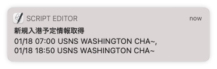

# Arrival information of large military vessels in Tokyo Bay (Uraga Channel)

大型官船の浦賀水道航路通過情報自動取得プログラム

海上自衛隊のいずも型ヘリコプター搭載護衛艦や輸送艦、米海軍の原子力空母などの一定以上の規模の官船が東京湾にくる際に浦賀水道を通ります。 東京湾海上交通センターはこの情報を随時更新しています。

このプログラムは東京湾海上交通センターのHPをスクレイピングして、新たに入港情報を得た際にデスクトップ通知するものです。 Macでの動作を確認しています。

## 使い方

1. install

```angular2html
$ pip3 install git+https://github.com/ProfFunami/Arrival_information_of_large_military_vessels.git
```

2. run

```angular2html
$ uraga_info 
```

result example:

```angular2html
$ uraga_info
HIT! 2022年01月17日 19:26:14

data:         01/18 07:00
name:         USNS WASHINGTON CHA~
type:         官船
country:     USA
destination:     横須賀

data:         01/18 18:50
name:         USNS WASHINGTON CHA~
type:         官船
country:     USA
destination:     横須賀

-------------------------
/
```

